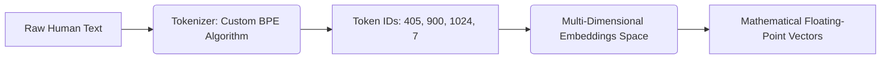
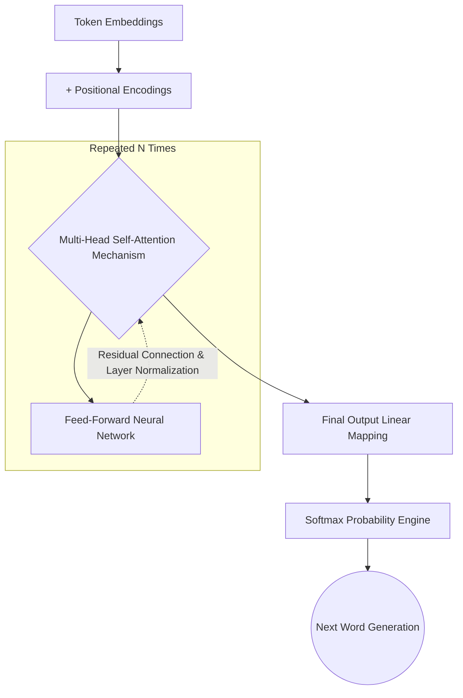
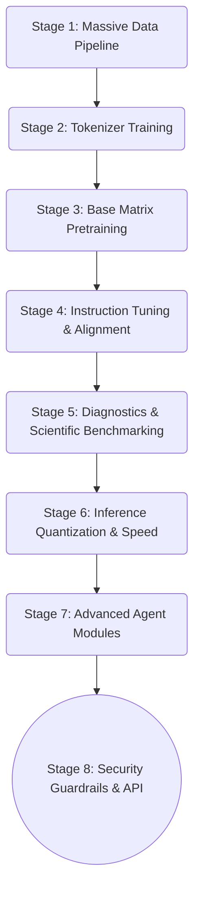

# ⚡ SPARK SLM ⚡
## The Custom Small Language Model Architecture & Implementation Handbook

Welcome to the **SPARK SLM** project! This repository contains the complete technical architecture, foundational theory, master implementation blueprint, and modular codebase for building a highly intelligent, custom, and hyper-focused **Small Language Model (SLM)** entirely from scratch.

Unlike massive Large Language Models (LLMs) such as GPT-4, Gemini, or Llama-3 that rely on billions of parameters to act as general-purpose, omnipresent assistants, SPARK represents a fundamentally different class of artificial intelligence. It is engineered with a strict prioritization for **efficiency, tight operational control, modular construction, mathematical transparency, and deep conceptual command**.

Rather than renting an API from a megacorporation, SPARK serves as a foundational neural framework that gives you **absolute authority** over its internal weights, training data, reasoning loops, and safety alignment. 

---

## 🧠 Part I: The Conceptual Brain of SPARK SLM

Before diving into code, it is absolutely critical to understand the mathematical and structural reality of the intelligence we are building. The "brain" of SPARK SLM does not *think* in the human sense; rather, it relies on advanced Deep Learning principles and the revolutionary **Transformer architecture** to simulate language understanding.

### 1. The Core Objective: Next-Token Prediction
If you strip away the hype, what is SPARK SLM internally? At its absolute core, SPARK is a statistical engine configured as a deep neural network designed for a single mathematical objective: **Next-Token Prediction**. 

If you feed the model the sequence: `"The sky is"`, its entire neural architecture—every matrix, every weight, every bias—is optimized to output the statistical probability that the next token is `"blue"`.

By repeating this deceptively simple objective iteratively across millions of text examples (a process known as self-supervised learning), the model begins to internalize human grammar, contextual reasoning, factual knowledge, and linguistic style. It learns that verbs follow nouns, that gravity pulls things down, and that code needs to compile.

### 2. The Text Representation Pipeline: Making English "Math"
Neural networks are massive calculators. They can only perform matrix multiplications on floating-point numbers; they cannot "read" English strings. Because of this, text must be translated before the model ever sees it.



- **Subword Tokenization (BPE)**: We split incoming text into small computational chunks called "tokens." These can be whole words, but in SPARK SLM, we use Byte Pair Encoding (BPE). This allows the model to handle rare or unknown words by splitting them into known phonetic parts (e.g., the word "unpredictable" becomes three tokens: "un" + "predict" + "able").
- **Dense Embeddings Space**: Once string text is tokenized into integer IDs (like token #405 and #900), these IDs are mapped to high-dimensional mathematical vectors called **Embeddings**. Imagine a 768-dimensional graph. In this vector space, tokens with similar semantic meanings (like "cat" and "dog") are plotted mathematically close to each other. The model literally learns meaning based on algebraic distance.

### 3. The Decoder-Only Transformer Structure
SPARK SLM utilizes a **Decoder-Only Transformer** architecture (the same underlying structure used by the GPT family). As the sequence of token embeddings flows through the deep network, it passes through multiple consecutive "Blocks."



- **Positional Encodings (RoPE / Sinusoidal)**: The Transformer network processes all words simultaneously in parallel (which makes it incredibly fast), rather than one by one sequentially. Because of this, it inherently loses the concept of "order." We fix this by injecting a positional math wave into the embedding so the model mathematically knows the order of the words in the sentence.
- **Multi-Head Self-Attention Mechanism**: This is the revolutionary heart of the model. When predicting a word, *self-attention* allows the current token to dynamically "look back" at all previous tokens to gather context. It calculates Query (Q), Key (K), and Value (V) matrices to mathematically score which prior words are most important to the current word's meaning. "He went to the bank to deposit cash" (financial bank) is differentiated from river bank entirely by the Self-Attention mechanism heavily weight-scoring the word "deposit".
- **Feed-Forward Networks (FFN)**: After the token gathers context via attention, the data passes through highly dense linear layers. These layers apply a mathematical non-linearity (like GeLU or ReLU activation functions), allowing the model to make complex logical leaps forward.
- **Residual Connections & Normalization**: To ensure the calculus stays stable across many deep layers and gradients don't vanish, we use skip-connections (adding the input to the output) and Layer Normalization to stabilize the variance of the data.

### 4. The Final Output Head & Token Selection
After the token vector is thoroughly enriched by passing through all Transformer Blocks, it hits a final linear projection layer. This scales the vector back out into the massive size of our entire vocabulary (e.g., an array of 32,000 numbers).
A generic `softmax` mathematical function is applied to turn these raw, unbounded scores (logits) into a clean, normalized probability distribution between 0% and 100%. The token with the highest probability is legally our predicted "next word."

---

## 🛠️ Part II: The 8-Stage Master Implementation Workflow

The construction of SPARK SLM from a blank text file into a talking, reasoning intelligence agent is broken down into exactly 8 modular, interdependent stages. This segmented architecture ensures that mathematical errors are isolated, and hardware development scales efficiently.



### Stage 1: Data Collection, Pipeline, & Cleaning
*The resulting intelligence of a model is entirely, 100% bottlenecked by the quality of its training data.*
- **Sourcing Architectures**: We aggregate high-quality, open-license text. To ensure generalized intelligence, this includes deep encyclopedic data, valid software engineering code architectures, technical documentation, public-domain textbooks, and conversational instructional sets. 
- **Cleaning Mechanics**: Raw internet text is completely toxic and mathematically useless. The pipeline scripts execute heavy Regex routines to remove chaotic HTML tags, null characters, duplicate paragraphs, empty arrays, and boilerplate navigation text from web scrapes. 
- **Normalization**: Enforcing strict, consistent encoding (UTF-8), stripping malformed unicode, and enforcing rigid spacing conventions. 

### Stage 2: Tokenizer Engineering & Custom Training
*We do not use an off-the-shelf tokenizer from OpenAI or Meta.* A custom tokenizer ensures the model's vocabulary perfectly aligns with its specific training data domain.
- We train a **BPE (Byte Pair Encoding)** model statistically over the cleaned dataset from Stage 1. Algorithms scan the dataset to find the most mathematically common character pairings and fuse them together.
- The absolute vocabulary size is heavily optimized and restricted (e.g., exactly 8,000 to 32,000 tokens) to balance the model's memory footprint against its ability to rapidly express complex human language.

### Stage 3: The Base Neural Network & PyTorch Pretraining Engine
This is the most computationally expensive and brutal phase of the project: literally teaching raw matrices the structure of human language from nothing.
- **The PyTorch Modeling Engine**: We mathematically code the exact architecture of the Decoder-Only model, explicitly hardcoding the Embedding Space, the Multi-Head Attention mechanisms, and the Feed-Forward neural classes.
- **The Batch Training Loop**: The dataset is numerically sliced into thousands of context windows (e.g., exactly 512 or 1024 tokens long). 
- **Forward Pass & The Loss Function**: The empty model runs an untrained forward pass over the data. We calculate the Cross-Entropy Loss (a strict algebraic representation of exactly how wrong its prediction was compared to the actual real-world text).
- **Backpropagation & Optimizer**: We use the state-of-the-art `AdamW` optimizer paired with extremely strict Learning Rate Warmup/Decay scheduling (Cosine Decay) to retroactively travel backward through the network, micro-adjusting millions of weights to slowly drive the average loss toward zero over thousands of iterations.

### Stage 4: Instruction Tuning & Model Alignment
At the end of Stage 3, the model comprehensively knows English, but it is a terrible assistant. It operates purely as a pattern continuator. If you prompt it with "What is the capital of France?", it might complete the pattern by answering "What is the capital of Germany? What is the capital of Spain?".
- **Supervised Fine-Tuning (SFT)**: We reformat a specialized chunk of the dataset into strict, clean `Instruction -> System -> Response` formatted pairs.
- By continuously running the Stage 3 training loop on this highly structured conversational data, the model learns to permanently *stop pattern-matching raw text* and *start answering user instructions directly and helpfully.*

### Stage 5: Scientific Evaluation & Diagnostic Benchmarking
How do we mathematically prove the PyTorch tensors are actually learning intelligence and not just memorizing the text file?
- **Convergence Validations**: Strict monitoring of the loss curves on isolated, unseen *validation data* to rapidly detect when the model begins to overfit (memorize) the training data.
- **Qualitative Stress Testing**: We push adversarial, logically complex, or mathematical prompts into the frozen model to identify catastrophic repetitive text loops, grammatical collapse, or unhinged reasoning hallucinations.

### Stage 6: Inference Optimization & Scaling Theory
Once the mathematical model weights are frozen and proven to work, we design the **Inference Engine**—the actual runtime script that dynamically generates new text in real-time.
- **Key-Value (KV) Caching Algorithms**: Generating text token-by-token is extraordinarily slow. We program a cache to store the 'Key' and 'Value' attention matrices of previously generated tokens in RAM, so the model only calculates massive attention vectors for the *newest* token, vastly accelerating chat speed.
- **Stochastic Sampling Algorithms**: Instead of always boringly taking the absolute 1st most probable word (Greedy Decoding), we inject controlled randomness into the Softmax output using `Temperature`, `Top-K`, and `Nucleus (Top-P)` sampling logic. This allows the model to occasionally pick the 2nd or 3rd most likely word, granting it human-like variety and creative variance.
- **Weight Quantization**: If the model is too massively large for standard consumer GPUs, we slice the math precision from 32-bit floating points down to 8-bit or 4-bit integers, slashing VRAM memory requirements exponentially while barely hurting performance.

### Stage 7: Advanced Agent Modules & Tool Execution
A static text-generator is heavily computationally limited; an Agent is boundlessly powerful. 
- We wrap the isolated SPARK core tensor in a logical Python algorithmic framework.
- **External Tool Calling via JSON**: If a user asks "What is 1,234,567 multiplied by 890?", the Agent recognizes its own mathematical neural weakness on raw calculus, halts its own text generation, triggers an external Python calculator API via strict JSON output, injects the real-world answer back into its own context window, and continues responding seamlessly like a human.

### Stage 8: Security Guardrails & Final API Deployment
The critically final step is transitioning from isolated developer training scripts to consumer-facing, robust web applications.
- **Safety Protocol Integration**: Adding strict, rule-based Regex prompt filters to aggressively reject malicious injection attempts, evaluating ethical refusal constraints so the model legally declines highly dangerous instructions.
- **Asynchronous Deployment**: Wrapping the frozen inference engine into a lightning fast, asynchronous `FastAPI` backend. Front-end UIs, mobile apps, or command-line interfaces can then seamlessly interact with the customized SLM as a standard, modular REST web service.

---

## 📂 The Complete Project Directory Blueprint

The physical layout of the codebase is strictly, rigidly mapped to the architectural stages detailed above. This organization guarantees mathematical modularity and allows distinct parts of the pipeline (like data cleaning vs. model training) to operate entirely independently of one another.

```bash
c:\Users\MITHUN\Desktop\STUDIES\PROJECT\42.SPARK - My own slm\
│
├── data/                            # Comprehensive Data Storage Hub
│   ├── raw/                         # Untouched web scrapes, raw books, and unstructured text
│   ├── processed/                   # Consolidated, strictly chunked, normalized .txt or .jsonl
│   └── tokenizer/                   # The compiled, trained custom BPE tokenizer and vocab files
│
├── src/                             # Core Python Execution Logic
│   │
│   ├── data_pipeline/               # Stage 1: Ingestion & Normalization Systems
│   │   ├── collector.py             # Scripts for pulling, downloading, or formatting raw data
│   │   └── cleaner.py               # Heavy Regex routines to scrub HTML, null bytes, formatting
│   │
│   ├── tokenizer/                   # Stage 2: Tokenization Systems
│   │   └── bpe_tokenizer.py         # Script to compile and train the BPE vocab array
│   │
│   ├── model/                       # Stage 3: Foundational PyTorch Matrix Architecture
│   │   ├── config.py                # Hyperparameter definitions (layers, heads, embed_dim)
│   │   ├── modules.py               # Isolated LayerNorm, Attention, and FFN PyTorch tensors
│   │   └── transformer.py           # The unified, compiled Decoder-Only SPARK Model structure
│   │
│   ├── training/                    # Stage 3 & 4: Model State Optimization Engines
│   │   ├── pretrain.py              # Massive, parallel batch training loop for base intelligence
│   │   └── finetune.py              # Specialized, delicate loop for instruction/behavior tuning
│   │
│   ├── evaluation/                  # Stage 5: Diagnostics & Metrix
│   │   └── evaluate.py              # Loss charting, perplexity math, and validation checkpoints
│   │
│   ├── inference/                   # Stage 6: Generation Pipeline
│   │   └── generator.py             # Autoregressive decoding, KV Cache memory, Top-K/P samplers
│   │
│   ├── agent/                       # Stage 7: Amplified Autonomy
│   │   ├── agent_core.py            # The central REPL reasoning loop
│   │   └── tools.py                 # External API wrappers (calculators, web search integration)
│   │
│   └── deployment/                  # Stage 8: User Interfaces & APIs
│       ├── api.py                   # FastAPI application asynchronous routing
│       └── safety.py                # Input sanitization logic and refusal guardrails
│
├── requirements.txt                 # Exact, frozen library version locks (PyTorch, Tokenizers)
└── main.py                          # Unified CLI Entrypoint (e.g., python main.py --train)
```
```markdown
## Conclusion

The SPARK Model project provides a modular, end-to-end framework for developing foundational transformer architectures from scratch. By isolating each stage of the lifecycle—from raw data ingestion and BPE tokenization to autoregressive inference and autonomous agent integration—this repository serves as a robust blueprint for building scalable, high-performance language models.

## License

This project is licensed under the MIT License - see the [LICENSE](LICENSE) file for details.
```
